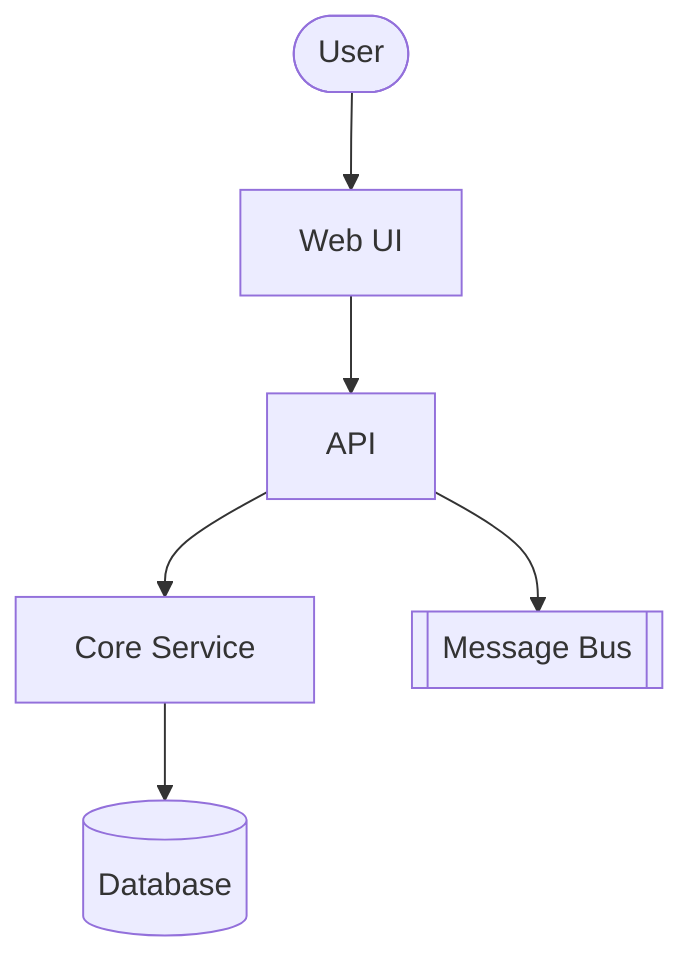
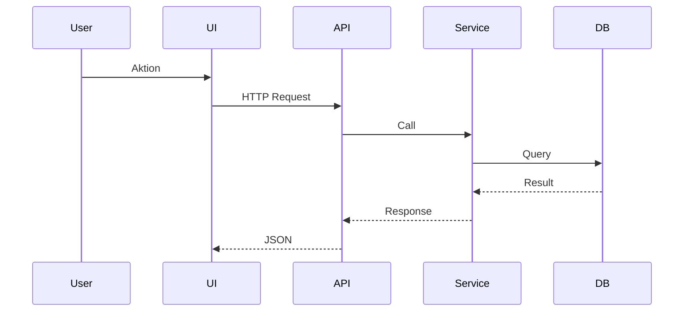

## Zweck
Leitet aus den **Selections** eine **einheitlich dokumentierte Struktur** ab: System-/Container-Übersicht, Komponenten pro Container, Schnittstellen und 1–2 Sequenzen. **Neutral & leichtgewichtig** (Markdown + kleine Mermaid-Skizzen), damit daraus später **C4** oder **arc42** generiert werden kann.

## Eingaben (read-only)
- `design/selections.md` (immer gelesen)
- `principles/project-principles.md` (immer gelesen)
- `context/context.md`, `context/domain.md`, `context/workload.md` (falls vorhanden)
- `--input`: zusätzliche Dokumente (z. B. Schnittstellen-Spezifikationen, Modellskizzen)

## Outputs
- **Immer:** `design/structure.md` (neue oder aktualisierte Fassung)
- **Zusätzlich (Dateien):**
  - `design/diagrams/system.mmd` (System-/Container-Übersicht)
  - `design/diagrams/components-<container>.mmd` (optional je Container)
  - `design/diagrams/sequence-<name>.mmd` (mind. eine Sequenz)

## Aufruf-Logik
- **Erster Aufruf:** Interview → grobe Struktur sammeln, Vorschläge generieren.
- **Erneuter Aufruf:** **Refine-Modus** → gezielte Ergänzungen/Korrekturen.
- **Mit `--restart`:** ignoriert bestehende Inhalte und startet neu.

## Vorgehen
1) **Lesen & Prüfen**
   - Selections/Prinzipien einlesen; Domain/Workload berücksichtigen.
2) **Interview (schrittweise, eine Frage pro Schritt)**
   
   **System-/Container-Interview:**
   - **Erste Frage**: "Welche Hauptcontainer/Services soll das System haben?" (z.B. UI, API, Services, DB, Messaging, Externals)
   - Antwort abwarten, dann bei Bedarf nachfragen: "Gibt es weitere Container die Sie vergessen haben?"
   
   **Komponenten-Interview (pro Container):**
   - **Pro Container einzeln fragen**: "Welche Hauptkomponenten soll Container X enthalten?" 
   - Beispiele nennen: Ports/Use Cases, Adapter, Services, Module
   - Antwort abwarten, dann nächsten Container
   
   **Schnittstellen-Interview (pro Schnittstelle):**
   - **Pro Schnittstelle einzeln**: "Wie kommuniziert Container A mit Container B?"
   - Detailsfragen einzeln: "Welches Protokoll?", "Welches Format?", "Wie häufig?", "Idempotent oder transaktional?"
   
   **Sequenzen-Interview:**
   - **Erste Frage**: "Welche 1-2 Kernabläufe sollen wir als Sequenz dokumentieren?"
   - **Pro gewählte Sequenz**: "Beschreiben Sie den Ablauf für [Sequenz X] Schritt für Schritt"
3) **Artefakte erzeugen** (immer Markdown + Mermaid)
   - `system.mmd`: einfache Knoten/Beziehungen zwischen Containern/Externals
   - `components-<container>.mmd`: optionale Skizzen pro Container
   - `sequence-<name>.mmd`: Sequenzdiagramm(e)
   - **WICHTIG**: Verwende nach der Erstellung aller `.mmd`-Dateien den `mermaid-expert` Subagent, um die Mermaid-Syntax zu validieren und zu korrigieren
4) **Diff zeigen → Schreiben**
   - Änderungen erst nach Bestätigung schreiben.

## Formatvorgaben
### `design/structure.md`

```md
# Architecture Structure

## System / Container Overview
- <Container/Service>: Zweck, Hauptverantwortung, Datenhaltung, Textuelle Beschreibung des Systems und der Container.
- Beziehungen (kurz): <A> → <B> (Protokoll, Daten), Textuelle Beschreibung der Beziehungen.



## Components per Container
 Textuelle Beschreibung der Components

* <Container X>
  - Komponente A – Verantwortung, Abhängigkeiten (kurz)
  - Komponente B – …

```mermaid
%% optional file: design/diagrams/components-<container>.mmd
graph TD
  subgraph <Container X>
    A[Komponente A]
    B[Komponente B]
  end
  A --> B
```

## Key Sequences

* Use Case 1: Akteure, beteiligte Container/Komponenten, Hauptschritte

Textuelle Beschreibung des Ablaufs.



## Interfaces

| Schnittstelle      | Producer → Consumer | Protokoll | Format | Frequenz  | Bemerkungen    |
| ------------------ | ------------------- | --------- | ------ | --------- | -------------- |
| UI → API           | UI → API            | HTTP      | JSON   | n/a       | idempotent?    |
| Service → DB       | Service → DB        | JDBC      | SQL    | n/a       | Transaktional? |
| Service → ext. API | Service → ExtSys    | HTTPS     | JSON   | on demand | Rate Limit: …  |

## Deployment (optional)

* Nodes/Zonen, Latenzanforderungen, State/Topology-Hinweise

## Validierung
- **Konsistenz:** Struktur passt zu Selections/Context; keine widersprüchlichen Verantwortlichkeiten.
- **Vollständigkeit:** Mindestens System-/Container-Übersicht + 1 Sequenz.
- **Lesbarkeit:** Mermaid-Syntax valid; bei Fehlern `mermaid-expert` Subagent verwenden.

## Exit-Kriterien
- `design/structure.md` existiert und beschreibt System/Container, Komponenten, Schnittstellen, mind. eine Sequenz.

