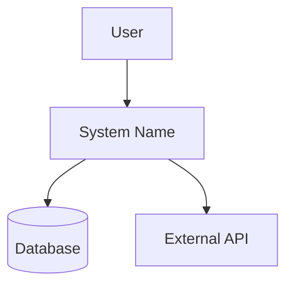

## Zweck
Aus den **Design-Dokumenten** (`design/*.md`) und **Context-Informationen** (`context/*.md`) wird eine vollständige arc42-Architekturdokumentation generiert. Das Command analysiert vorhandene Strukturen und erstellt alle 12 arc42-Kapitel mit Mermaid-Diagrammen.

## Eingaben
- **Basis-Referenz:** `design/*.md`
- **Context:** `context/*.md`
- **Optional:** `--restart` (sichert alte Version und startet neu)

## Outputs
- **Verzeichnis:** `export/arc42/` mit modularer Struktur
- **Sprache:** Deutsch, wenn nicht vom Nutzer anders gefordert
- **Index:** `export/arc42/INDEX.md` (Übersicht und Navigation)
- **Kapitel:** Separate `.md`-Dateien pro arc42-Kapitel
- **Diagramme:** Separate `.mmd`-Dateien pro Diagramm

## Vorgehen
1) **Backup bei --restart**: Falls `export/arc42/` existiert:
   - Erstelle `export/backup-{timestamp}/arc42/` (komplettes Verzeichnis)
   - Starte komplett neu

2) **Update-Modus**: Ohne `--restart` bei existierendem Verzeichnis:
   - Analysiere bestehende `export/arc42/` Struktur
   - Identifiziere Änderungen in Source-Dokumenten
   - Führe Refinement/Update durch

3) **Analyse**: Lese alle relevanten Design- und Context-Dokumente:
   - `design/structure.md` → Bausteinsicht und Komponenten identifizieren
   - `design/selections.md` → Lösungsstrategie und Technologieentscheidungen extrahieren  
   - `design/operability.md` → Verteilungssicht und Querschnittliche Konzepte ableiten
   - `context/domain.md` → Kontextabgrenzung und fachliche Anforderungen
   - `context/integrations.md` → Externe Systeme und Schnittstellen

4) **arc42-Mapping**: Transformiere gefundene Strukturen zu arc42-Kapiteln:
   - **Kapitel 1-2**: Ziele und Randbedingungen aus Context
   - **Kapitel 3**: Kontextabgrenzung aus Domain und Integrations
   - **Kapitel 4**: Lösungsstrategie aus Selections
   - **Kapitel 5**: Bausteinsicht aus Structure
   - **Kapitel 6-7**: Laufzeit- und Verteilungssicht aus Operability
   - **Kapitel 8**: Querschnittliche Konzepte aus Design-Patterns
   - **Kapitel 9**: Architekturentscheidungen aus vorhandenen ADRs
   - **Kapitel 10-12**: Qualität, Risiken, Glossar

5) **Diagramm-Generierung**: Erstelle Mermaid-Diagramme für relevante Kapitel:
   - Verwende camelCase-Namenskonventionen  
   - Medium Abstraktionslevel
   - Konsistente Farb- und Symbol-Kodierung

6) **Validierung**: Prüfe auf:
   - Vollständigkeit aller 12 Kapitel
   - Konsistenz zwischen den Kapiteln
   - Referenz-Integrität zu ADRs und anderen Dokumenten

7) **Template-Anwendung**: Nutze `templates/arc42.md` als Strukturbasis

8) **Review**: Zeige Struktur der zu erstellenden/aktualisierenden `export/arc42/` Dateien

9) **Schreiben**: Nach Bestätigung Verzeichnisstruktur erstellen/aktualisieren

## Formatvorgaben
### Verzeichnisstruktur `export/arc42/`
```
export/arc42/
├── INDEX.md                    # Navigation und Übersicht
├── 01-einfuehrung-ziele.md    # Einführung und Ziele
├── 02-randbedingungen.md      # Randbedingungen
├── 03-kontextabgrenzung.md    # Kontextabgrenzung
├── 03-kontextabgrenzung.mmd   # Context-Diagramm
├── 04-loesungsstrategie.md    # Lösungsstrategie
├── 05-bausteinsicht.md        # Bausteinsicht
├── 05-bausteinsicht.mmd       # Baustein-Diagramm
├── 06-laufzeitsicht.md        # Laufzeitsicht
├── 06-laufzeitsicht.mmd       # Laufzeit-Diagramm
├── 07-verteilungssicht.md     # Verteilungssicht
├── 07-verteilungssicht.mmd    # Deployment-Diagramm
├── 08-querschnittlich.md      # Querschnittliche Konzepte
├── 09-entscheidungen.md       # Architekturentscheidungen
├── 10-qualitaet.md           # Qualitätsanforderungen
├── 11-risiken.md             # Risiken und technische Schulden
└── 12-glossar.md             # Glossar
```

### INDEX.md Format
- **Metadata**: System, Version, Agent-ID, Timestamp
- **Navigation**: Links zu allen 12 arc42-Kapiteln und Diagrammen
- **Übersicht**: Kurze Beschreibung der arc42-Struktur
- **Validierungsregeln**: Status der Vollständigkeits- und Konsistenz-Checks

### Diagramm-Konventionen


## Backup-Struktur
Bei `--restart`:
```
export/
├── arc42/                      # Neue modulare Version
│   ├── INDEX.md
│   ├── 01-einfuehrung-ziele.md
│   └── ...
└── backup-20240821-143022/     # Timestamp-Ordner
    └── arc42/                  # Gesichertes Verzeichnis
        ├── INDEX.md
        └── ...
```
