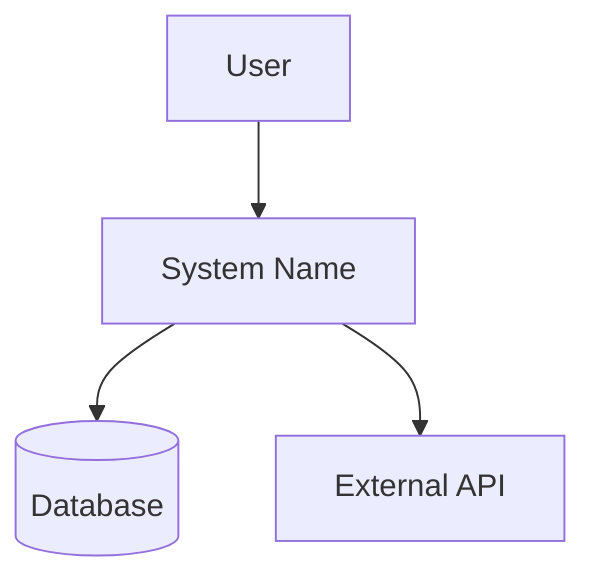

## Zweck
Aus den **Design-Dokumenten** (`design/*.md`) und **Context-Informationen** (`context/*.md`) wird eine vollständige C4-Architekturdokumentation generiert. Das Command analysiert vorhandene Strukturen und erstellt die vier C4-Ebenen mit Mermaid-Diagrammen.

## Eingaben
- **Basis-Referenz:** `design/*.md`
- **Context:** `context/*.md`
- **Optional:** `--restart` (sichert alte Version und startet neu)

## Outputs
- **Verzeichnis:** `export/c4/` mit modularer Struktur
- **Sprache:** Deutsch, wenn nicht vom Nutzer anders gefordert
- **Index:** `export/c4/INDEX.md` (Übersicht und Navigation)
- **Kapitel:** Separate `.md`-Dateien pro C4-Ebene
- **Diagramme:** Separate `.mmd`-Dateien pro Diagramm

## Vorgehen
1) **Backup bei --restart**: Falls `export/c4/` existiert:
   - Erstelle `export/backup-{timestamp}/c4/` (komplettes Verzeichnis)
   - Starte komplett neu

2) **Update-Modus**: Ohne `--restart` bei existierendem Verzeichnis:
   - Analysiere bestehende `export/c4/` Struktur
   - Identifiziere Änderungen in Source-Dokumenten
   - Führe Refinement/Update durch

3) **Analyse**: Lese alle relevanten Design- und Context-Dokumente:
   - `design/structure.md` → Container und Komponenten identifizieren
   - `design/selections.md` → Technologieentscheidungen extrahieren  
   - `design/operability.md` → Deployment-Szenarien ableiten
   - `context/domain.md` → Business-Kontext und externe Akteure
   - `context/integrations.md` → Externe Systeme und Schnittstellen

4) **C4-Mapping**: Transformiere gefundene Strukturen zu C4-Elementen:
   - **Level 1 (Context)**: System + externe Benutzer/Systeme aus Context
   - **Level 2 (Container)**: Services, Databases, Frontend aus Structure
   - **Level 3 (Components)**: Interne Module aus detaillierten Struktur-Infos
   - **Level 4 (Code)**: Falls Code-Details in Dokumenten vorhanden
   - **Level 5 (Deployment)**: Infrastruktur aus Operability-Docs

5) **Diagramm-Generierung**: Erstelle Mermaid-Diagramme für jede Ebene:
   - Verwende camelCase-Namenskonventionen  
   - Medium Abstraktionslevel
   - Konsistente Farb- und Symbol-Kodierung

6) **Validierung**: Prüfe auf:
   - Dependency-Zyklen zwischen Komponenten
   - Konsistenz zwischen den Ebenen
   - Vollständigkeit der Schnittstellen-Beschreibungen

7) **Template-Anwendung**: Nutze `templates/c4.md` als Strukturbasis

8) **Review**: Zeige Struktur der zu erstellenden/aktualisierenden `export/c4/` Dateien

9) **Schreiben**: Nach Bestätigung Verzeichnisstruktur erstellen/aktualisieren

## Formatvorgaben
### Verzeichnisstruktur `export/c4/`
```
export/c4/
├── INDEX.md                    # Navigation und Übersicht
├── 01-context.md              # Level 1: Kontextdiagramm
├── 01-context.mmd             # Mermaid-Diagramm für Context
├── 02-containers.md           # Level 2: Container
├── 02-containers.mmd          # Mermaid-Diagramm für Container
├── 03-components.md           # Level 3: Komponenten
├── 03-components.mmd          # Mermaid-Diagramm für Komponenten
├── 04-code.md                 # Level 4: Code (optional)
├── 04-code.mmd                # Mermaid-Diagramm für Code
├── 05-deployment.md           # Level 5: Deployment
└── 05-deployment.mmd          # Mermaid-Diagramm für Deployment
```

### INDEX.md Format
- **Metadata**: System, Version, Agent-ID, Timestamp
- **Navigation**: Links zu allen Kapiteln und Diagrammen
- **Übersicht**: Kurze Beschreibung der C4-Ebenen
- **Validierungsregeln**: Status der automatischen Konsistenz-Checks

### Diagramm-Konventionen


## Backup-Struktur
Bei `--restart`:
```
export/
├── c4/                         # Neue modulare Version
│   ├── INDEX.md
│   ├── 01-context.md
│   └── ...
└── backup-20240821-143022/     # Timestamp-Ordner
    └── c4/                     # Gesichertes Verzeichnis
        ├── INDEX.md
        └── ...
```
